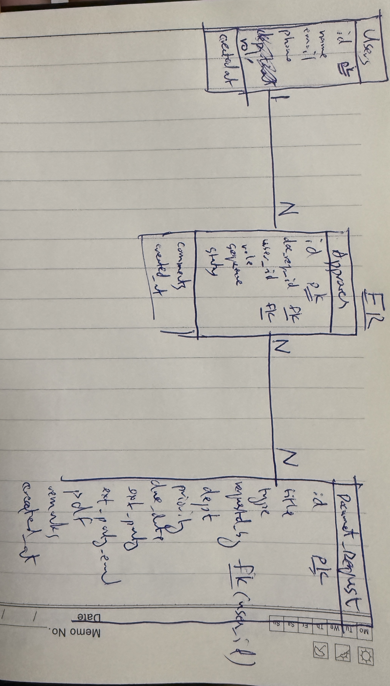
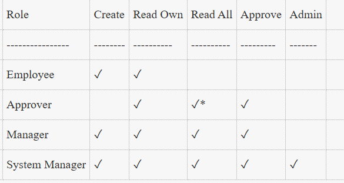

# HAK Engineering — Document Approval System

App deployed on my hostinger server and is LIVE:

https://hak.originalbyte.site/

## Tech Stack

Backend:  Node.js  / Express 
Database: MySQL                       
Frontend: Vanilla HTML / CSS / JavaScript + jQuery

## Entity-Relation (sketch)

## API Reference

GET    `/api/requests`                List all requests 

POST   `/api/requests`                Create request (`multipart/form-data`)

GET    `/api/requests/:id`            Get request + approvers    

GET    `/api/requests/:id/pdf`        Serve attached PDF                    
      
POST   `/api/requests/approve/:id`    Approve or reject (sequential check)

## Part 1 — Requirements Thinking & Assumptions

### Questions I would ask the business

1. **Who can submit/view a request?** Any employee, or only certain roles/departments? And are approvals department specific?

Assume: For demo purposes, all employees have full permissions and no department constraints. Login is simple (unsecure)

2. **Approval roles?** It is unclear what constraints should be on the approval roles (Reviewer, Signatory etc). Can each request have any number and comnbiation of these roles?

Assume: Approval roles are cosmetic and there are no constraints. In production, this would not be the case.

3. **What happens after rejection?** Can the requester edit and resubmit, or is the request permanently closed?

Assume: For demo purposes, rejection is permanent and request cannot be edited.

4. **Notifications:** Should approvers receive an email/WhatsApp notification when it's their turn? Does the requester get notified on status changes?

Assume: No notifications for demo purposes

5. **Goals:** What is the end-goal of this system? To save time, digitisation, reduce paper etc ? And what is the current workflow in the company for document approval ?

Based on the answers to this question, tweaks can be made to the system.

## Part 3 — ERP / Frappe Thinking

### 1. How would you map this into an ERP system?
Frappe
`Document Request` = DocType with a child table `Approval Chain` (equivalent to the `approvers` table). 
The workflow state (`Draft → Pending Approval → Approved / Rejected`) maps directly to a Frappe `Workflow` with `Transitions` and allowed `roles` per state. The PDF attachment is a standard Frappe file attachment field.
`Permissions` will be related to approval `Action`, view request, create request etc.
`Reports` will be generated for history, auditing etc

### 2. Which parts should be configurable by admin users?

- **Approval templates** — Approvers per Request Type (so users don't manually add approvers every time).
- **Request Types** — the enum list for request types.
- **Departments** — linked to the HR -> Employee -> Department.
- **Notification templates** — who gets notified and when (email/WhatsApp).

### 3. What permissions would you apply?

* read all where they are assigned as approvers

### 4. What validations should happen server-side?

- PDF must be attached before Submit.
- At least one approver before Submit.
- Only the current pending approver (by sequence) can approve/reject.
- Due date cannot be in the past on submission.
- One rejection causes the whole request to Rejected.

### 5. What audit trail would you keep?

- **Version history** on `Document Request` — every field change logged with user + timestamp (Frappe's built-in versioning / `Document Version`).
- **Approver action log** — `action_date`, `comments`, and the acting user on each `Approver` row.
- **File version log** — if PDF is replaced, keep the old file.
- **Communication log** — record every email/notification sent.
- **Login / access log** — who viewed the request and when (Frappe's Activity Log).

### 6. Frappe / ERPNext concepts expected

Already mentioned in point 1.

## Design Decisions

- **Node + mySQL** - Technology I am familiar with. jQuery only for frontend because it's an ERP and we don't need to focus too much on design
- **Entities** - ER sketch provided above. I made a modification and added a Users entity. (Best practice to always have a unique user_id)
- **Server** - I already had a hostinger domain for my portfolio / personal website. So I added the application LIVE as a subdomain (removes need for you to download, setup etc)
- **Authentication** - Auth and users are handled partly via localStorage to keep things simple (for a prototype)

### TODO

- **No authentication** — Demo only so using test users and no security rules. Not safe for production
- **Draft** — Draft state not added due to time constraint. 
- **Validation** — external email, whatsapp validation
- **Edge cases** — I have done limited testing so edge cases might not be handled. Bugs possible. Unit tests not written
- **Responsiveness** — Have not checked mobile / responsive layout